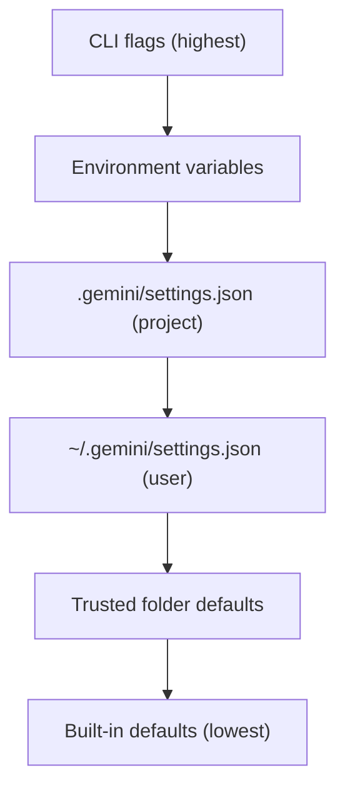

# Advanced Settings & Experimental Tweaks

Deep configuration techniques sourced from research and community best practices. For basic setup, see [Getting Started](./getting-started.md).

## Configuration Hierarchy

Gemini CLI uses a layered configuration system centered on the `.gemini/` directory:



| Layer | File | Scope |
|---|---|---|
| **Project Config** | `.gemini/settings.json` | Per-project settings |
| **User Config** | `~/.gemini/settings.json` | Global defaults |
| **Context Memory** | `GEMINI.md` | Project-level persistent context |
| **Ignore Rules** | `.geminiignore` | File exclusion patterns |
| **Trust** | Trusted folders | Auto-approve for known dirs |

## The .gemini/ Strategic Command Center

```
.gemini/
├── settings.json       # Project settings
├── GEMINI.md           # Persistent context/instructions
├── .geminiignore       # File exclusion patterns
├── styles/             # Custom output styles
├── skills/             # Agent skills
│   └── <skill>/
│       └── SKILL.md
└── hooks/              # Lifecycle hooks
```

## settings.json — Full Reference

### Secure Configuration Profile

```json
{
  "theme": "dark",
  "codeStyle": "detailed",
  "sandbox": true,
  "yolo": false,
  "autoRun": false,
  "context": {
    "fileFiltering": true,
    "importFormat": "abbreviated"
  },
  "model": {
    "default": "gemini-3-pro",
    "plan": "gemini-3-flash",
    "fallback": "gemini-3-fast-preview"
  },
  "mcp": {
    "allowed": ["context7", "filesystem"],
    "blocked": ["untrusted-server"]
  }
}
```

### Model Switching per Task Type

| Task | Model | Rationale |
|---|---|---|
| General coding | `gemini-3-pro` | Balanced speed/quality |
| Fast iteration | `gemini-3-flash` | Low latency |
| Plan mode | `gemini-3-flash` | Quick analysis |
| Complex reasoning | `gemini-3-pro` + extended | Deep analysis |

```text
/model set gemini-3-flash           # Quick tasks
/model set gemini-3-pro --persist   # Save as default
```

## GEMINI.md — Project Context File

### Advanced Template

```markdown
# Project Context

## Identity
You are a senior backend engineer working on a Python FastAPI application.

## Stack
- Python 3.12, FastAPI, SQLAlchemy 2.0, Alembic
- PostgreSQL 16, Redis 7
- pytest, mypy (strict), ruff

## Conventions
- All endpoints return Pydantic V2 models
- Use async/await throughout
- Database sessions managed via dependency injection
- Alembic migrations: `alembic revision --autogenerate -m "description"`

## Security
- Never hardcode secrets
- Environment variables via python-dotenv
- All user inputs validated via Pydantic

## @imports
@./docs/api-spec.md
@./docs/architecture.md
```

> [!TIP]
> Use `@./path/to/file.md` on its own line to import external files into GEMINI.md context. The Memory Import Processor concatenates them at runtime.

## Trusted Folders

Mark directories as trusted to skip confirmation prompts:

```text
/permissions trust /path/to/project
```

Trusted folders auto-approve:
- File reads and writes within the directory
- Shell commands scoped to the directory
- Tool executions targeting project files

> [!WARNING]
> Only trust directories you own. Trusted folders bypass safety prompts for all operations within them.

## Policy Engine (Experimental)

### Command Policies

Define fine-grained rules for command execution:

```toml
# .gemini/policies.toml

[[rules]]
description = "Allow read-only git commands"
action = "allow"
commandPrefix = "git status"
priority = 10

[[rules]]
description = "Block destructive git operations"
action = "deny"
commandPrefix = "git push"
priority = 100

[[rules]]
description = "Prompt for package installs"
action = "ask_user"
commandRegex = "^(pip|npm|yarn) install"
priority = 50
```

### Policy Priority

Higher `priority` numbers win when rules conflict. Built-in defaults use low priorities so your custom rules take precedence.

## Hooks System

### PRE_COMMAND and POST_COMMAND

```json
{
  "hooks": {
    "PRE_COMMAND": "echo 'About to run: $GEMINI_COMMAND'",
    "POST_COMMAND": "echo 'Completed: $GEMINI_COMMAND'"
  }
}
```

### Auto-Format Hook

```json
{
  "hooks": {
    "POST_COMMAND": {
      "matcher": "write_file",
      "command": "npx prettier --write $GEMINI_FILE_PATH"
    }
  }
}
```

## Sandboxing

### Sandbox Modes

| Mode | Behavior |
|---|---|
| `sandbox: true` | Commands run in isolated environment |
| `sandbox: false` | Direct system access (use with trusted folders only) |
| `yolo: true` | Skip ALL confirmations (⚠️ dangerous) |

> [!CAUTION]
> `yolo: true` disables all safety checks. Only use in disposable environments (containers, CI).

### .geminiignore

Prevent sensitive files from being indexed:

```
# .geminiignore
.env
.env.*
*.pem
*.key
secrets/
node_modules/
.git/
__pycache__/
*.pyc
dist/
build/
```

## Wave Dispatch Orchestration

Advanced multi-agent pattern for parallelizing work:

```
Wave 1: Agent A (scaffold) + Agent B (research)
   ↓ barrier
Wave 2: Agent C (implement) + Agent D (implement)
   ↓ barrier
Wave 3: Agent E (test) + Agent F (review)
```

Run agents in background with checkpoint-based state recovery:

```bash
# POSIX background execution
gemini --headless "Build auth module" &
gemini --headless "Build user module" &
wait  # barrier
gemini --headless "Integration tests" &
```

## Experimental Features

### Browser Agent (v0.31.0)

New experimental browser agent for web page interaction:

```json
{
  "experimental": {
    "browserAgent": true
  }
}
```

### Direct Web Fetch

Rate-limited web fetch tool:

```json
{
  "experimental": {
    "directWebFetch": true,
    "webFetchRateLimit": 10
  }
}
```

### In-Progress Steering Hints

Guide the agent mid-execution without interrupting:

```text
# While agent is running, type steering hints
# The agent incorporates them into its current plan
```

### Plan Mode Custom Storage

```json
{
  "plan": {
    "storageDir": ".gemini/plans/",
    "autoModelSwitch": true,
    "summarizeAfterExecution": true
  }
}
```

## Performance Tuning

### Token Optimization

- Keep GEMINI.md focused — under 2000 tokens
- Use `.geminiignore` aggressively to exclude large files
- Use `/compress` to replace chat history with summaries
- Use `/stats model` to monitor token usage and quota

### Monitoring

```text
/stats session    # Session usage statistics
/stats model      # Token/quota info
/stats tools      # Tool usage frequency
```

Check tool thrashing: if `/stats tools` shows excessive `read_file` calls in loops, add more context to GEMINI.md to reduce file scanning.

## See Also

- [Features](./features.md) — Core features overview
- [Commands](./commands.md) — CLI reference
- [Best Practices](./best-practices.md) — Prompt and usage best practices
- [Official Links](./official-links.md) — All official sources
