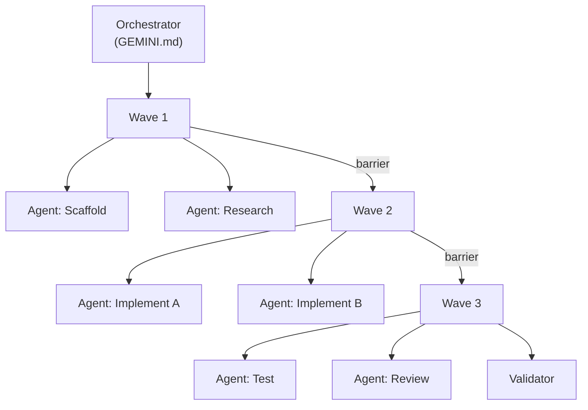

# Experimental Settings & Research-Based Tweaks

> [!WARNING]
> These techniques are sourced from deep research, community experiments, and cutting-edge patterns. They may change, break, or require specific versions. Use at your own risk.

## Wave Dispatch Orchestration

### Architecture

The Wave Dispatch pattern transforms Gemini CLI from a single-agent tool into a concurrent multi-agent pipeline:



### Implementation

```bash
# Wave 1: Parallel scaffold + research
gemini --headless "Create project scaffold with auth module interfaces" &
gemini --headless "Research and document API requirements" &
wait  # Barrier — both must complete

# Wave 2: Parallel implementation
gemini --headless "Implement auth module from scaffold" &
gemini --headless "Implement user module from scaffold" &
wait  # Barrier

# Wave 3: Test + review
gemini --headless "Run all tests and fix failures" &
gemini --headless "Security review of all changes" &
wait  # Final validation
```

### TaskPacket Protocol

Structure inter-agent communication with JSON task packets:

```json
{
  "taskId": "auth-001",
  "agentRole": "implementer",
  "inputs": {
    "specFile": "task-reports/scaffold-spec.json",
    "constraintFile": "GEMINI.md"
  },
  "outputs": {
    "reportFile": "task-reports/auth-report.json",
    "completionSignal": "TASK_COMPLETE"
  },
  "ttl_minutes": 30
}
```

## Guardian Security Layer

### Pre/Post Hook Enforcement

```json
{
  "hooks": {
    "BeforeToolUse": [
      {
        "matcher": "shell_command",
        "command": "python .gemini/guardian/validate_command.py \"$GEMINI_COMMAND\"",
        "abort_on_failure": true
      }
    ],
    "AfterToolUse": [
      {
        "matcher": "write_file",
        "command": "python .gemini/guardian/validate_output.py \"$GEMINI_FILE_PATH\"",
        "abort_on_failure": true
      }
    ]
  }
}
```

### Guardian Validation Script

```python
# .gemini/guardian/validate_command.py
import sys, json

BLOCKED = ["rm -rf", "curl.*|.*sh", "chmod 777", "git push --force"]
command = sys.argv[1]

for pattern in BLOCKED:
    if pattern in command:
        print(f"BLOCKED: {command} matches deny rule '{pattern}'")
        sys.exit(1)

sys.exit(0)  # Allow
```

### JSON Schema Contract Enforcement

Force agents to produce structured output:

```markdown
# GEMINI.md — Output Contract

## Required Output Format
All agent responses MUST be valid JSON matching this schema:
```json
{
  "status": "success|failure|needs_review",
  "files_changed": ["path/to/file.ts"],
  "tests_run": 12,
  "tests_passed": 12,
  "summary": "Brief description of changes"
}
```
```

## Maestro Multi-Agent Platform

[Maestro](https://github.com/josstei/maestro-gemini) turns Gemini CLI into a 12-agent platform:

### Available Specialist Agents

| Agent | Role | Invocation |
|---|---|---|
| **Architect** | System design | `/skills run architect` |
| **Coder** | Implementation | `/skills run coder` |
| **Debugger** | Bug diagnosis | `/skills run debugger` |
| **Reviewer** | Code review | `/skills run reviewer` |
| **Security** | Vulnerability scan | `/skills run security` |
| **Performance** | Profiling | `/skills run performance` |
| **Documenter** | Auto-docs | `/skills run documenter` |
| **Tester** | Test generation | `/skills run tester` |
| **DevOps** | CI/CD setup | `/skills run devops` |
| **Refactorer** | Code cleanup | `/skills run refactorer` |
| **Migrator** | Code migration | `/skills run migrator` |
| **Analyst** | Codebase analysis | `/skills run analyst` |

### 4-Phase Orchestration

```
Phase 1: Plan    → Architect produces spec
Phase 2: Execute → Coder + specialists implement
Phase 3: Verify  → Tester + Reviewer validate
Phase 4: Deploy  → DevOps prepares release
```

## Telemetry & Profiling

### OpenTelemetry Export

Enable telemetry in `settings.json`:

```json
{
  "telemetry": {
    "enabled": true,
    "exporter": "json_lines",
    "output": ".gemini/telemetry/"
  }
}
```

### Custom Metric Fields

| Field | Purpose |
|---|---|
| `wave_completion_time_ms` | Total time from dispatch to validation |
| `agent_queue_depth` | Tasks waiting for concurrency slot |
| `tool_retry_rate` | Ratio of hook rejections to successes |
| `latency_per_turn_ms` | API response time per generation |
| `task_success_rate` | % of tasks completing without escalation |

> [!TIP]
> High `agent_queue_depth` means your `maxConcurrentAgents` cap is too low. High `tool_retry_rate` means prompt templates are generating malformed tool calls.

## FastMCP TTL Caching

### Read-Heavy Resource Caching

MCP servers should implement TTL caching for frequently accessed files:

```javascript
// FastMCP server with caching
const cache = new Map();
const TTL_MS = 60_000; // 60 seconds

server.tool("read_cached", "Read file with cache", { path: "string" }, async ({ path }) => {
  const cached = cache.get(path);
  if (cached && Date.now() - cached.time < TTL_MS) {
    return { content: [{ type: "text", text: cached.data }] };
  }
  const data = await fs.readFile(path, "utf-8");
  cache.set(path, { data, time: Date.now() });
  return { content: [{ type: "text", text: data }] };
});
```

## Experimental Features (v0.31.0)

### Browser Agent

Direct web page interaction from the CLI:

```json
{
  "experimental": {
    "browserAgent": true,
    "browserAgentTimeout": 30000
  }
}
```

Use cases:
- Scrape API documentation for context
- Test web UIs during development
- Capture screenshots for visual verification

### Direct Web Fetch with Rate Limiting

```json
{
  "experimental": {
    "directWebFetch": true,
    "webFetchRateLimit": 10,
    "webFetchTimeoutMs": 15000
  }
}
```

### In-Progress Steering Hints

Guide the agent mid-execution:
```text
# While agent is working, type a steering hint:
"Focus on the database layer first"
# Agent incorporates hint without restarting
```

### Plan Mode Enhancements

```json
{
  "plan": {
    "storageDir": ".gemini/plans/",
    "autoModelSwitch": true,
    "summarizeAfterExecution": true,
    "model": "gemini-3-flash"
  }
}
```

- **Custom storage** — Plans persist to `.gemini/plans/` for review
- **Auto model switch** — Uses faster model for planning, better model for execution
- **Post-execution summary** — Automatically summarizes work after plan execution

### Project-Level Policies (v0.31.0)

```toml
# .gemini/policies.toml — Project-scoped policy

[[rules]]
description = "MCP wildcard allow"
action = "allow"
mcp_server = "*"
tool_annotation = "read_only"

[[rules]]
description = "Block network egress"
action = "deny"
command_regex = "^(curl|wget|fetch)"
```

## Context Optimization Research

### GEMINI.md Import Processor

```markdown
# GEMINI.md with dynamic imports

@./docs/architecture.md
@./docs/api-contracts.md
@./src/types/index.ts
```

The Memory Import Processor concatenates imported files at runtime. Verify with:
```text
/memory show    # Display full concatenated memory
```

### File Filtering for Large Repos

```
# .geminiignore — aggressive filtering
node_modules/
dist/
build/
*.min.js
*.map
*.lock
vendor/
__pycache__/
*.pyc
.git/
coverage/
```

### Token Budget Strategy

| Context Section | Token Budget | Purpose |
|---|---|---|
| GEMINI.md + imports | 2,000 max | Project identity |
| Active file context | 5,000 max | Current work |
| Conversation history | Remaining | Dialogue |

Monitor with `/stats model` — if consistently near context limit, prune imports.

## See Also

- [Advanced Settings](./advanced-settings.md) — Production-ready configuration
- [Features](./features.md) — Core features
- [Commands](./commands.md) — CLI reference
- [Changelog](./changelog.md) — Latest version features
