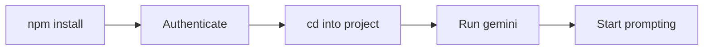

# Getting Started with Gemini CLI

Gemini CLI brings the power of Google's advanced language models directly to your terminal. It helps you understand code, generate solutions, manage files, and automate workflows from the command line.

## Prerequisites

- **Node.js 18+** and **npm** installed.
- A **Google account** for authentication.

> [!NOTE]
> Certain Google Cloud or enterprise account types may require additional project configuration. See the [Authentication Guide](https://geminicli.com/docs/get-started/authentication/) for details.

## Installation

Install Gemini CLI globally via npm:

```bash
npm install -g @google/gemini-cli
```

For additional installation options, see the [Installation Guide](https://geminicli.com/docs/get-started/installation/).

## Authentication

1. Launch Gemini CLI:

   ```bash
   gemini
   ```

2. When prompted, select **Login with Google**.
3. Authenticate via the browser popup.

Once authenticated, your credentials are stored locally.

## First Session



Open a terminal in any project directory and launch:

```bash
cd /path/to/your/project
gemini
```

Try some initial prompts:

```text
Explain this codebase to me.
```

```text
@src/ Summarize the code in this directory.
```

> [!TIP]
> Use `@path/to/file` to inject file or directory contents directly into your prompt.

## Check Usage & Quota

Monitor your token usage and quota with:

```text
/stats model
```

## Essential Commands

| Command | Description |
|---|---|
| `/help` or `/?` | Show available commands |
| `/clear` | Clear the terminal display |
| `/settings` | Open the configuration editor |
| `/model set <name>` | Switch the active model |
| `/chat save <tag>` | Save current conversation state |
| `/chat resume <tag>` | Resume a saved conversation |
| `/resume` | Browse and resume previous sessions |
| `/plan` | Switch to Plan Mode (read-only) |
| `/quit` or `/exit` | Exit Gemini CLI |

See the full [Commands Reference](./commands.md) for all slash commands, at-commands, and shortcuts.

## What's Next?

- [Gemini CLI Examples](https://geminicli.com/docs/get-started/examples/) — See what Gemini CLI can do
- [Configuration](https://geminicli.com/docs/reference/configuration/) — Customize behavior and settings
- [Tutorials](https://geminicli.com/docs/cli/tutorials/file-management/) — Step-by-step guides
- [Extensions](https://geminicli.com/docs/extensions/) — Extend Gemini CLI with plugins
